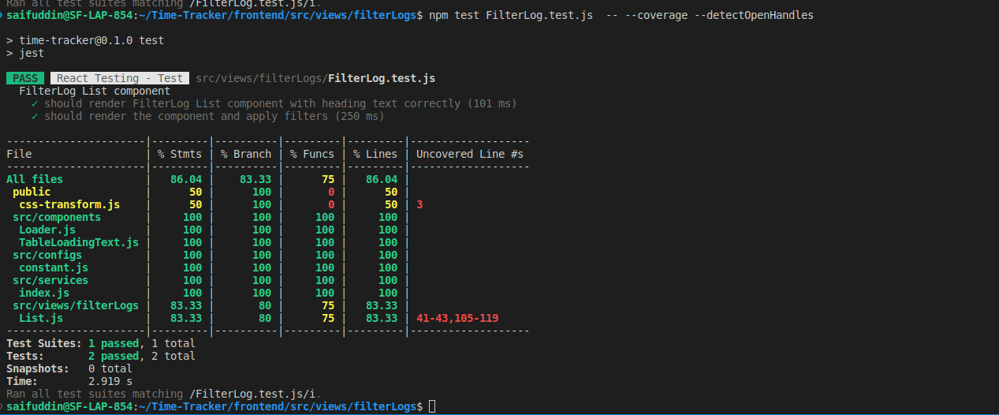

# React-Testing Application

## Steps follow to run application in your system

1. First clone the repo from github usign following `command`
   `git clone https://github.com/saif-simform/React-Testing.git`

2. It will clone both `frontend` and `backend` code.

## Backend Setup:

-----> Application backend is developed using `node.js` as javascript framework and `mongodb` as database server

### Installation

To run application install dependencies first:

Install the dependencies:

```bash

npm install

```

### Import database

You will find a DB folder in the home directory which contain `test_db` database.

import `test_db` database into your system using following command.

`mongorestore --db=test_db <--path-->`

Note: `path` could be /home/ubuntu/project/React-Testing/backend/DB

### Create .env File

Set the environment variables:

You will find a example.env file in the home directory. Paste the contents of that into a file named .env in the same directory. Fill in the variables to fit your application

## Available Scripts

In the project directory, you can run:

### `npm start`

Runs the app in the development mode.\
Open [http://localhost:3000](http://localhost:3000) to view it in your browser.

## To create admin user first goto `seeder` folder then run following command to run seeder file

`node admin.js`

### Login with different creds:

## Admin Login

email: admin@design.com,
password: 123123,

---

## Frontend Setup:

----> Application frontend is developed using `React.js` framework with `reactstrap` designing library.

### Installation

To run application install dependencies first:

Install the dependencies:

```bash

npm install

```

### Create .env File

Set the environment variables:

You will find a example.env file in the home directory. Paste the contents of that into a file named .env in the same directory. Fill in the variables to fit your application

## Available Scripts

In the project directory, you can run:

### `npm start`

Runs the app in the development mode.\
Open [http://localhost:3001](http://localhost:3001) to view it in your browser.

### Login with different creds:

## Admin Login

email: admin@design.com,
password: 123123,

## User Login

1. email: saifuddin@simformsolutions.com, password: 123123

2. email: san@gmail.com, password: 123123

### Video Link:
`https://drive.google.com/file/d/1QHlc4whu6XQspO7QglBF1S_imVXpyapj/view?usp=share_link`

### How to run test cases

1. To run all frontend test cases use `npm test`
2. To run a specific test file use `npm test relative_path (Note: Replace relative_path  with your test file path)`
3. For test coverage of a single test file
    
    `npm test **relative_path** -- --coverage --detectOpenHandles`
   
   
   
  